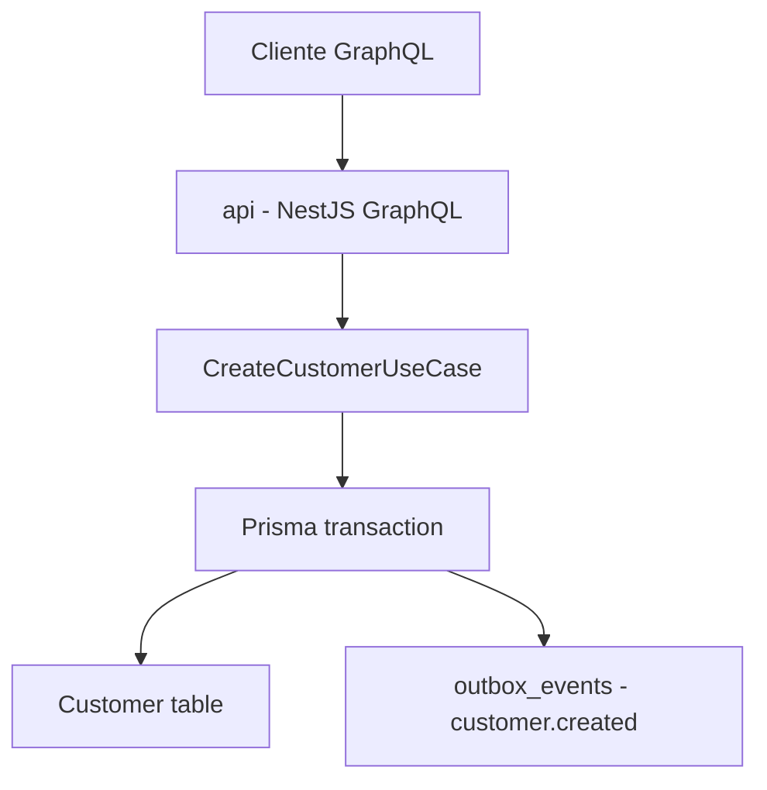
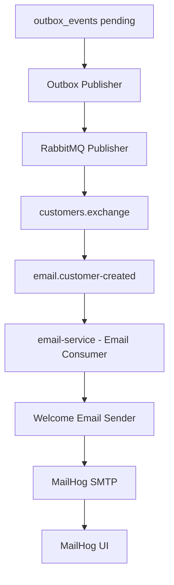
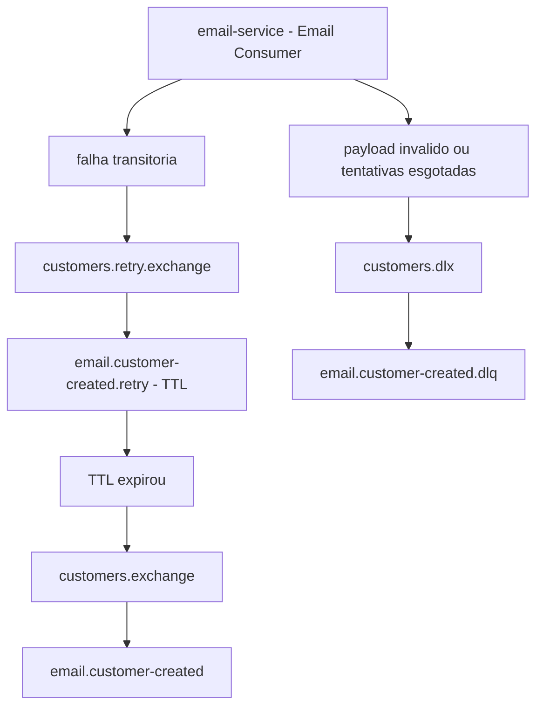

# NestJS DDD Customers

API de clientes em NestJS com DDD, GraphQL, Prisma/PostgreSQL, RabbitMQ e um worker separado de e-mail usando MailHog.

## Serviços

As URLs abaixo usam os valores padrão do `.env.example`.

- API: http://localhost:3000/graphql
- API health: http://localhost:3000/health
- API metrics: http://localhost:3000/metrics
- Serviço de e-mail: worker em background que consome mensagens do RabbitMQ
- Serviço de e-mail health: http://localhost:3001/health
- Serviço de e-mail metrics: http://localhost:3001/metrics
- RabbitMQ UI: http://localhost:15672 (`guest` / `guest`)
- RabbitMQ metrics: http://localhost:15692/metrics
- MailHog UI: http://localhost:8025
- Prometheus: http://localhost:9090
- Grafana: http://localhost:3002 (`admin` / `admin`)
- PostgreSQL 18: `localhost:5432`

## Arquitetura

- `api`: API GraphQL responsável pelo domínio de clientes, persistência dos clientes e gravação do evento `customer.created` na outbox.
- `outbox_events`: tabela no PostgreSQL que guarda eventos pendentes de publicação.
- `CustomerCreatedOutboxPublisher`: publisher em background que publica eventos pendentes da outbox no RabbitMQ.
- `email-service`: processo NestJS separado que consome `customer.created` do RabbitMQ e envia o e-mail de boas-vindas via SMTP.
- `rabbitmq`: broker com topic exchange entre a API e o serviço de e-mail.
- `mailhog`: SMTP local para capturar e inspecionar os e-mails enviados.

### Cadastro



### Envio



### Retry e DLQ



## Arquivo de ambiente

Crie um arquivo `.env` antes de iniciar a aplicação, seguindo o `.env.example`.

Para usar os mesmos valores padrão do arquivo de exemplo:

```bash
cp .env.example .env
```

Ajuste o `.env` quando portas, credenciais ou endereços de serviços forem
diferentes dos valores padrão.

## Execução local

```bash
npm install
npm run prisma:generate
docker compose up -d postgres rabbitmq mailhog
npm run prisma:migrate
npm run start:dev
```

Ao executar os processos Node fora do Docker, inicie a API e o serviço de
e-mail em terminais separados:

```bash
npm run start:dev
npm run start:email
```

## Execução com Docker

É necessário ter Docker e Docker Compose instalados.

Para subir a stack completa em background usando o `Dockerfile` de produção:

```bash
docker compose up --build -d
```

A stack completa também sobe Prometheus e Grafana. O Prometheus coleta
métricas da API, do worker de e-mail e do RabbitMQ; o Grafana provisiona o
dashboard `Customers Observability` e alertas locais a partir dos arquivos em
`docker/grafana`.

Para subir a stack em modo de desenvolvimento, com a API usando
`Dockerfile.dev`, `npm run start:dev` e o código-fonte montado no container:

```bash
docker compose -f docker-compose.yml -f docker-compose.dev.yml up --build -d
```

Nesse modo, PostgreSQL, RabbitMQ, MailHog e o worker de e-mail continuam vindo
do compose base. Apenas a API é sobrescrita pelo `docker-compose.dev.yml`.

Para subir a stack com simulação de falhas no envio de e-mail:

```bash
docker compose -f docker-compose.yml -f docker-compose.chaos.yml up --build -d
```

Esse modo usa o mesmo `email-service`, mas sobrescreve as variáveis
`EMAIL_FAILURE_SIMULATION_ENABLED=true` e
`EMAIL_FAILURE_SIMULATION_RATE=0.5`. A cada tentativa de envio, o worker tem
50% de chance de lançar uma falha antes de chamar o SMTP, exercitando o fluxo
de retry e DLQ.

Para combinar API em modo de desenvolvimento com o worker em modo chaos:

```bash
docker compose -f docker-compose.yml -f docker-compose.dev.yml -f docker-compose.chaos.yml up --build -d
```

Para parar a stack de produção e remover containers órfãos:

```bash
docker compose down --remove-orphans
```

Para parar a stack de desenvolvimento, use os mesmos arquivos Compose usados no
comando de subida:

```bash
docker compose -f docker-compose.yml -f docker-compose.dev.yml down --remove-orphans
```

Para parar a stack com simulação de falhas, use os mesmos arquivos Compose:

```bash
docker compose -f docker-compose.yml -f docker-compose.chaos.yml down --remove-orphans
```

Para parar a stack combinando desenvolvimento e chaos:

```bash
docker compose -f docker-compose.yml -f docker-compose.dev.yml -f docker-compose.chaos.yml down --remove-orphans
```

## Configuração de ambiente

A aplicação valida as variáveis de ambiente de runtime ao iniciar. Existem
conjuntos de validação separados para a API GraphQL e para o worker de e-mail,
então cada processo exige apenas os valores que realmente usa.

- `NODE_ENV` deve ser `development` na execução local e `production` nos
  serviços Docker de produção.
- `DATABASE_URL`, `RABBITMQ_URL` e `SMTP_HOST` apontam para serviços locais
  quando a aplicação roda diretamente no host.
- `DOCKER_DATABASE_URL`, `DOCKER_RABBITMQ_URL` e `DOCKER_SMTP_HOST` são usados
  pelo Docker Compose para conexões entre containers.
- Variáveis de porta como `API_PORT`, `POSTGRES_PORT` e
  `RABBITMQ_MANAGEMENT_PORT` controlam as portas expostas no host pelo Docker
  Compose.
- `OBSERVABILITY_PORT` controla o servidor HTTP de health e métricas do
  worker de e-mail.
- `PROMETHEUS_PORT`, `GRAFANA_PORT` e `RABBITMQ_PROMETHEUS_PORT` controlam as
  portas de observabilidade expostas no host.
- `GRAFANA_ADMIN_USER` e `GRAFANA_ADMIN_PASSWORD` controlam o acesso local ao
  Grafana.
- `OUTBOX_PUBLISH_INTERVAL_MS`, `OUTBOX_PUBLISH_BATCH_SIZE`,
  `OUTBOX_RETRY_DELAY_MS`, `OUTBOX_MAX_ATTEMPTS` e
  `OUTBOX_PROCESSING_TIMEOUT_MS` controlam o publisher de eventos pendentes da
  outbox.
- `EMAIL_FAILURE_SIMULATION_ENABLED` e `EMAIL_FAILURE_SIMULATION_RATE`
  controlam a simulação de falha no envio de e-mail. Por padrão a simulação
  fica desligada.

Os endpoints `/metrics` foram pensados para o ambiente local de estudo e para
scrape interno do Prometheus. Não exponha esses endpoints publicamente sem uma
camada explícita de rede/autenticação.

Os testes não exigem um arquivo `.env.test` dedicado. Testes unitários devem
fornecer seus próprios fixtures ou mocks de configuração, sem depender da
configuração local de runtime.

Se você já criou o volume local do PostgreSQL com uma versão major anterior,
recrie o volume antes de iniciar o PostgreSQL 18:

```bash
docker compose down -v
docker compose up --build
```

As imagens Docker do PostgreSQL 18 esperam o volume persistente em
`/var/lib/postgresql`, não em `/var/lib/postgresql/data`. Por isso, volumes
locais antigos de versões anteriores precisam ser recriados para este ambiente
de desenvolvimento.

## Carga de cadastros

Com a API em execução, use o script abaixo para criar 300 clientes via GraphQL:

```bash
./scripts/create-customers.sh
```

Para ajustar a quantidade ou a URL da API:

```bash
TOTAL=50 API_URL=http://localhost:3000/graphql ./scripts/create-customers.sh
```

O script gera e-mails e CPFs válidos para a carga. Para repetir uma execução
com os mesmos dados, informe manualmente `RUN_ID` e `CPF_SEED`.

## Exemplo GraphQL

```graphql
query {
  customers(limit: 20, offset: 0, orderBy: CreatedAt, orderDirection: Desc) {
    total
    limit
    offset
    orderBy
    orderDirection
    hasNextPage
    items {
      id
      name
      email
    }
  }
}
```

```graphql
mutation {
  createCustomer(
    input: {
      name: "Maria Silva"
      email: "maria@example.com"
      phone: "+55 81 99999-9999"
      cpf: "529.982.247-25"
      address: {
        street: "Rua das Flores"
        number: "123"
        complement: "Apt 401"
        neighborhood: "Boa Viagem"
        city: "Recife"
        state: "PE"
        zipCode: "51020-000"
      }
    }
  ) {
    id
    name
    email
    cpf
    address {
      city
      state
    }
  }
}
```

Ao criar um cliente, a API persiste `Customer` e `Address` e grava
`customer.created` na tabela `outbox_events` na mesma transação. O publisher da
outbox publica o evento em `customers.exchange` com confirmação do RabbitMQ, e o
`email-service` separado consome a mensagem pela fila `email.customer-created`
para enviar um e-mail de boas-vindas pelo MailHog.

Os IDs são gerados pelo PostgreSQL 18 com UUIDv7 nativo via
`DEFAULT uuidv7()`.
