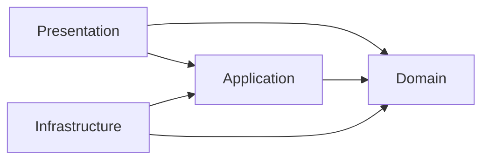
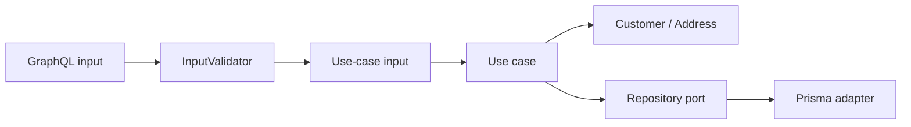

# Arquitetura

O projeto é um monólito modular NestJS. O módulo de clientes concentra o fluxo
de cadastro e consulta, enquanto o envio de e-mail é executado por um processo
separado que compartilha apenas o contrato do evento.

## Camadas



- `presentation`: resolvers, inputs e tipos GraphQL, validação da entrada e
  tradução de erros para respostas da API.
- `application`: casos de uso, contratos de entrada, erros de aplicação e ports
  necessários para executar os fluxos.
- `domain`: entidades, value objects e invariantes de clientes e endereços.
- `infrastructure`: adapters de persistência, publicação no RabbitMQ e
  processamento da outbox.
- `shared`: contratos e componentes reutilizados sem pertencer ao domínio de
  clientes, como paginação, validação e eventos de integração.

As dependências apontam para dentro: os casos de uso conhecem o domínio e os
ports, enquanto os adapters de infraestrutura implementam esses ports.

## Fluxo de uma mutation



O GraphQL define o contrato de transporte. Antes de chamar o caso de uso, o
resolver envia a entrada para um `InputValidator<T>`. Atualmente o adapter é
baseado em Zod, mas o resolver e os contratos da aplicação não dependem dessa
biblioteca.

Erros do Zod são convertidos para `InputValidationError`, que contém apenas uma
lista neutra de caminhos e mensagens. O resolver traduz esse erro para a
resposta GraphQL. As invariantes continuam protegidas pelo domínio mesmo que um
caso de uso seja chamado por outro adapter.

A motivação e os trade-offs dessa separação estão registrados no
[ADR 0002](adr/0002-input-validation-abstraction.md).

## Estrutura principal

```text
src/
  customers/
    application/       casos de uso, contratos e ports
    domain/            entidades, value objects e invariantes
    infrastructure/    Prisma, RabbitMQ e outbox
    presentation/      adapter GraphQL
  database/            configuração compartilhada do Prisma
  email/               worker de e-mail
  shared/              paginação, validação e eventos
```

## Persistência e eventos

O adapter Prisma cria `Customer`, `Address` e o evento `customer.created` na
mesma transação do PostgreSQL. A publicação acontece posteriormente por CDC ou
pelo publisher polling. Consulte [Mensageria](messaging.md) para o fluxo
completo e o [ADR 0001](adr/0001-transactional-outbox-for-customer-events.md)
para a decisão arquitetural.
