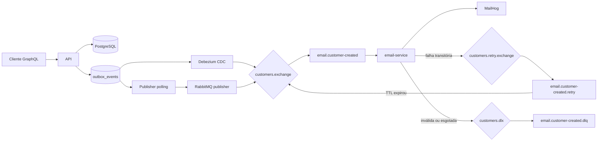

# Mensageria e transactional outbox

O evento `customer.created` conecta o cadastro realizado pela API ao worker de
e-mail. A entrega é assíncrona e possui semântica de pelo menos uma vez, então
consumidores devem tolerar mensagens duplicadas.

## Fluxo



Ao criar um cliente, o adapter Prisma persiste `Customer`, `Address` e uma
linha em `outbox_events` na mesma transação. Isso evita o dual write entre o
banco e o broker.

## Formas de publicação

### Debezium CDC

É o modo padrão da stack Docker. O Debezium observa inserts na tabela
`outbox_events` pelo WAL do PostgreSQL, aplica o `EventRouter` e publica apenas
o payload no exchange `customers.exchange` com routing key
`customer.created`.

O conector usa `snapshot.mode=no_data`: ao criar ou recriar o offset, ele não
publica as linhas antigas já existentes e passa a capturar novos inserts.

### Publisher polling

É usado na execução local ou como fallback sem CDC. Quando
`OUTBOX_PUBLISHER_ENABLED=true`, a API busca eventos pendentes em lotes usando
`FOR UPDATE SKIP LOCKED`, publica em um RabbitMQ `ConfirmChannel` e marca o
evento como `published`.

Falhas de publicação retornam o evento para `pending` até
`OUTBOX_MAX_ATTEMPTS`. Eventos que esgotam esse limite ficam com status
`failed`. Registros abandonados em `processing` podem ser retomados após
`OUTBOX_PROCESSING_TIMEOUT_MS`.

Os dois mecanismos não devem ficar habilitados simultaneamente para a mesma
outbox. No Compose, o Debezium fica ativo e o publisher polling é desabilitado.

## Worker de e-mail

O processo iniciado por `npm run start:email`:

1. declara exchanges e filas duráveis;
2. consome `email.customer-created` com prefetch 5;
3. valida o JSON do evento;
4. envia o e-mail pelo SMTP;
5. confirma a mensagem somente após concluir o processamento ou republicá-la
   para retry/DLQ.

Payload esperado:

```json
{
  "customerId": "019...",
  "name": "Maria Silva",
  "email": "maria@example.com",
  "createdAt": "2026-07-16T12:00:00.000Z"
}
```

## Retry e DLQ

Erros transitórios republicam a mensagem em `customers.retry.exchange` com o
header `x-retry-count` incrementado. A fila de retry mantém a mensagem pelo TTL
configurado e depois a devolve para o exchange principal.

Com `RABBITMQ_CUSTOMER_CREATED_MAX_RETRIES=3`, são realizadas até três novas
tentativas depois do processamento original. Ao esgotar o limite, a mensagem é
publicada em `email.customer-created.dlq`.

JSON inválido ou incompatível com o schema vai diretamente para a DLQ, sem
retry. Mensagens na DLQ recebem headers com a quantidade de tentativas, a
mensagem do erro e o horário da falha.

## Observabilidade local

- RabbitMQ Management: http://localhost:15672
- MailHog: http://localhost:8025
- tabela PostgreSQL: `outbox_events`

O modo chaos descrito em [Execução e configuração](running.md) permite testar
retry e DLQ sem indisponibilizar o SMTP manualmente.

## Limitações atuais

- A entrega é de pelo menos uma vez; duplicidades são possíveis.
- O worker não mantém uma inbox idempotente, portanto uma duplicidade pode
  produzir mais de um e-mail.
- A retenção ou limpeza periódica de eventos da outbox ainda não está
  implementada.
